# 🎓 OKÜ Student Information System (Öğrenci Bilgi Sistemi - OBS)

[](https://dotnet.microsoft.com/)
[](https://www.sqlite.org/)
[](https://tailwindcss.com/)
[](LICENSE)

---

## 🇺🇸 English Version

OKÜ Student Information System (OBS) is a high-density, modern, and fully responsive academic portal designed for computer engineering students and academic advisors. 

This project is built following modern web design trends (bento grid layout, glassmorphism, native dark/light theme integration, smooth micro-interactions) and industry-standard secure back-end patterns (PBKDF2 security hashing, cookie-based localization synchronization).

---

### ✨ Key Features

#### 👨‍🎓 Student Modules
- **Bento Grid Dashboard:** Displays academic status, GPA, ECTS, tuition fees, dining hall balance, upcoming course schedules, and recent announcements in a single clean layout.
- **Course Registration:** An advanced system for Major and Double Major (CAP) registration that validates schedule conflicts and course prerequisites.
- **Transcripts & Objections:** Allows viewing of semester letter grades, transcripts for major/CAP, and filing objections to exam grades.
- **Exemptions & Substitutions:** Request mapping of old/failed courses to new curriculum courses.
- **Document Requests:** File requests for official papers like Student Certificates or Transcripts with copy counts.
- **Messaging Portal:** Direct messaging inbox between students and advisors.

#### 👨‍🏫 Advisor Modules
- **Advisor Dashboard:** Detailed overview of average GPA statistics, student standings (high honors, warning list), and grade distributions.
- **Course Approvals:** Allows the advisor to review students' selected courses, total ECTS count, check credit limit violations, and approve/reject enrollments.
- **Student Management:** View full list of advisees and add new students through a clean modal form.
- **Grade & Attendance Entry:** Submit and update grades (midterm/final) and manage weekly absence logs for registered students, with automated FZ failure triggers.
- **Objections & Request Management:** Approve or reject grade objections, curriculum substitution petitions, and document requests.

#### ⚙️ Preferences & Security
- **Flicker-Free Theme Toggling:** Syncs dark/light mode dynamically through database properties and HTTP cookies to eliminate loading flickers.
- **Bilingual Interface (TR/EN):** Localizes both UI components and server validation error messages based on active cookies.
- **Cryptographic Passwords:** Passwords are securely stored in the SQLite database using **PBKDF2** (HMAC-SHA256) salted hashes.

---

### 🛠️ Tech Stack
- **Framework:** ASP.NET Core 9.0 (MVC)
- **Database:** SQLite (`obs.db`)
- **ORM:** Entity Framework Core (EF Migrations)
- **Security:** ASP.NET Core Cookie Authentication & `PasswordHasher<ApplicationUser>` (PBKDF2)
- **Styling:** Tailwind CSS (via CDN) & custom CSS utility variables
- **Font & Icons:** Google Fonts (Inter) & Google Material Symbols

---

### 🚀 Setup & Execution

#### Prerequisites
- [.NET 9.0 SDK](https://dotnet.microsoft.com/download/dotnet/9.0) must be installed.

#### Steps

1. Clone or download the repository:
   ```bash
   git clone https://github.com/emirtdede/Student-Information-System.git
   cd Student-Information-System
   ```

2. Restore dependencies and build:
   ```bash
   dotnet restore
   dotnet build
   ```

3. Update database schema (if `obs.db` is not present):
   ```bash
   dotnet ef database update
   ```

4. Start the application locally:
   ```bash
   dotnet run
   ```

5. Open your browser and navigate to the address shown in the console (e.g., `http://localhost:5177`):
   - **Student Access:** Student No: `20217170031` | Password: `EtdRke3101` (Emir Tarık Dede)
   - **Advisor Access:** Email: `ahmet.yilmaz@oku.edu.tr` | Password: `password` (Prof. Dr. Ahmet Yılmaz)

---

## 🇹🇷 Türkçe Versiyon (Ekran Görüntüleri ile)

OKÜ Öğrenci Bilgi Sistemi (OBS), bilgisayar mühendisliği öğrencileri ve akademik danışmanları için özel olarak tasarlanmış, yüksek bilgi yoğunluğuna sahip, modern ve responsive bir akademik portaldır. 

---

### 🖥️ Genel Ekranlar

#### 1. Hoş Geldiniz Sayfası
Sisteme giriş yapacak öğrencilerin ve akademisyenlerin karşılandığı, güncel duyuruların ve genel bilgilerin yer aldığı şık ana ekran.
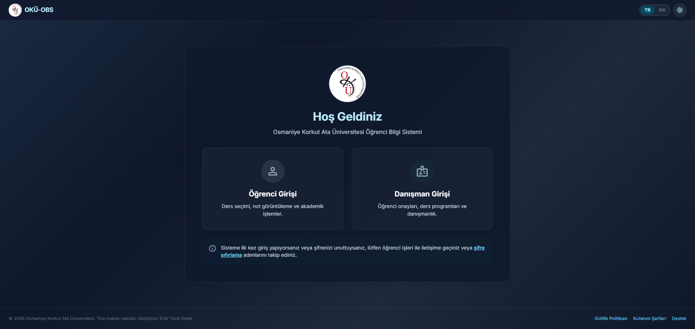

#### 2. Öğrenci Giriş Sayfası
Öğrencilerin öğrenci numaraları ve şifreleri ile güvenli bir şekilde sisteme giriş yaptıkları kimlik doğrulama ekranı.
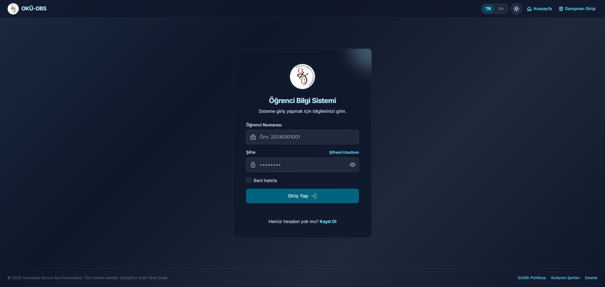

#### 3. Danışman Giriş Sayfası
Akademik danışmanların e-posta adresleri ve şifreleri ile OBS sistemine giriş yapabildikleri arayüz.
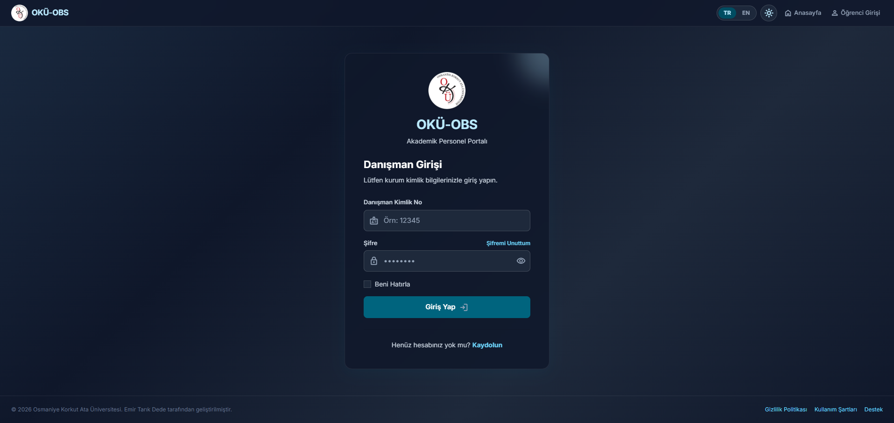

---

### 👨‍🎓 Öğrenci Ekranları

#### 4. Öğrenci Paneli (Dashboard)
Bento Grid tasarımı ile öğrencilerin akademik durum, GNO, AKTS, harç borcu, yemekhane bakiyesi ve haftalık ders programını tek bakışta görebildikleri ana ekran.
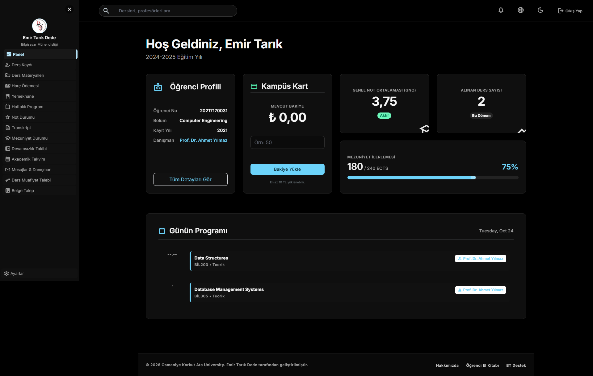

#### 5. Ders Kayıt Ekranı
Aktif dönemdeki derslerin seçildiği, çakışma ve ön koşul kontrollerinin yapıldığı ve danışman onayına gönderildiği ders seçim arayüzü.
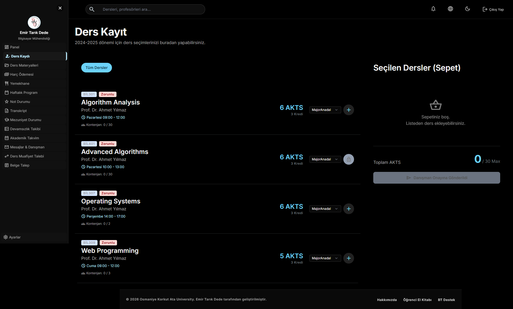

#### 6. Ders Materyalleri Sayfası
Öğrencilerin kayıtlı oldukları derslerin içeriklerini, haftalık dökümanlarını ve kaynaklarını görüntüleyebildikleri alan.
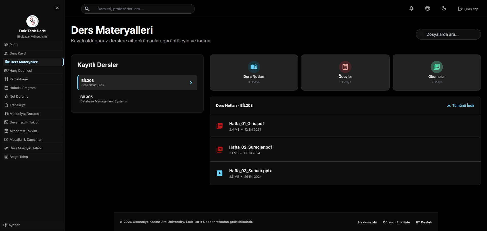

#### 7. Harç ve Ödemeler Ekranı
Dönemlik harç borçlarının, ödeme geçmişinin ve güncel finansal bilgilerin takip edildiği arayüz.
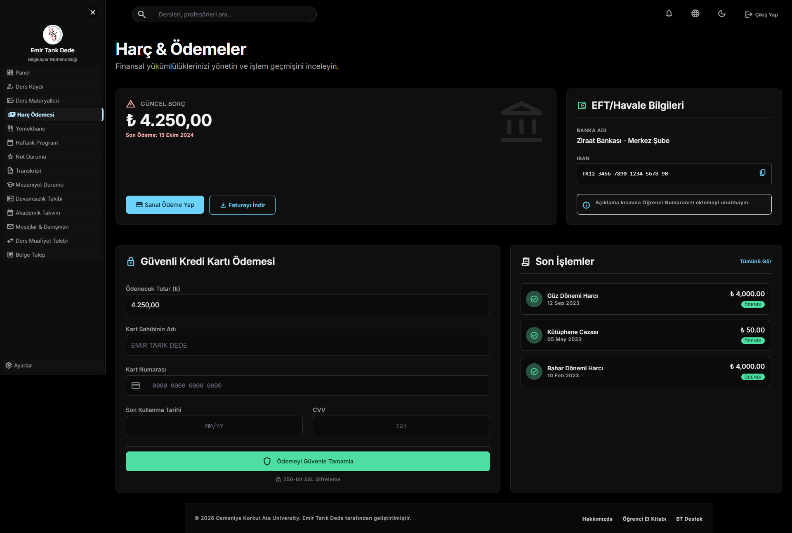

#### 8. Yemekhane Bakiye ve Menü Sistemi
Haftalık yemekhane menüsünün listelendiği ve öğrenci kartına online bakiye yüklemesi yapılabilen bakiye takip ekranı.
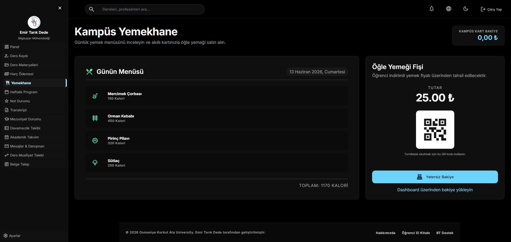

#### 9. Haftalık Ders Programı
Öğrencinin kayıtlı olduğu derslerin gün ve saat bilgilerini renkli ve düzenli bir takvim şemasında gösteren program arayüzü.
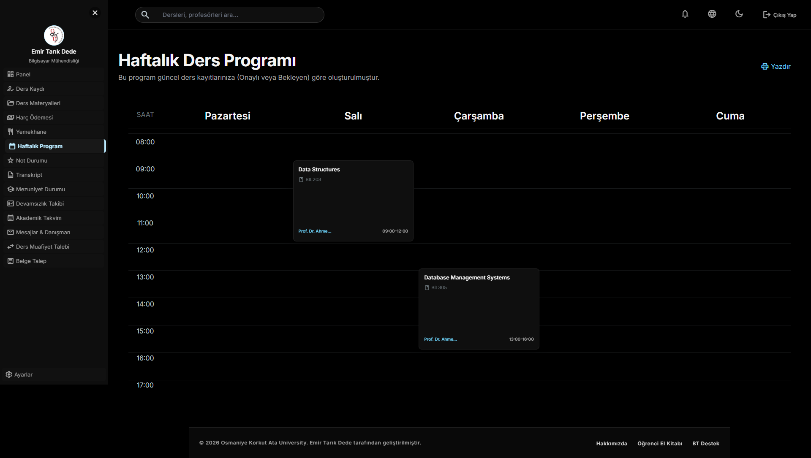

#### 10. Not Durumu Ekranı
Öğrencinin aldığı derslerin vize, final notlarını, başarı durumunu ve harf notlarını listelediği ekran.
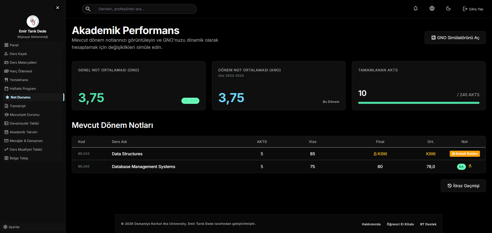

#### 11. Transkript Ekranı
Öğrencinin geçmiş dönemlerden bu yana aldığı tüm derslerin harf notlarını ve genel not ortalamasını resmi transkript formatında gösteren sayfa.
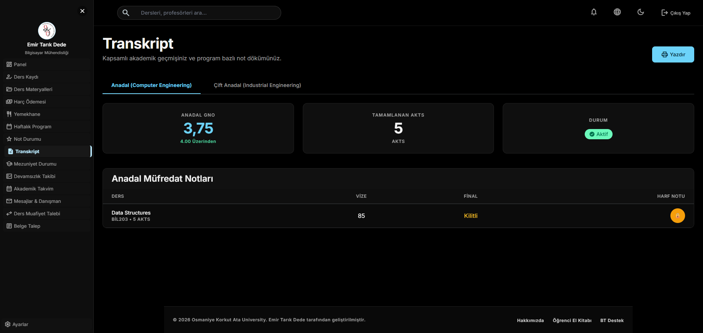

#### 12. Mezuniyet Durumu Takibi
Öğrencinin mezun olabilmesi için gerekli olan staj, AKTS yükü, zorunlu dersler gibi kriterlerin tamamlanma durumunu gösteren kontrol ekranı.
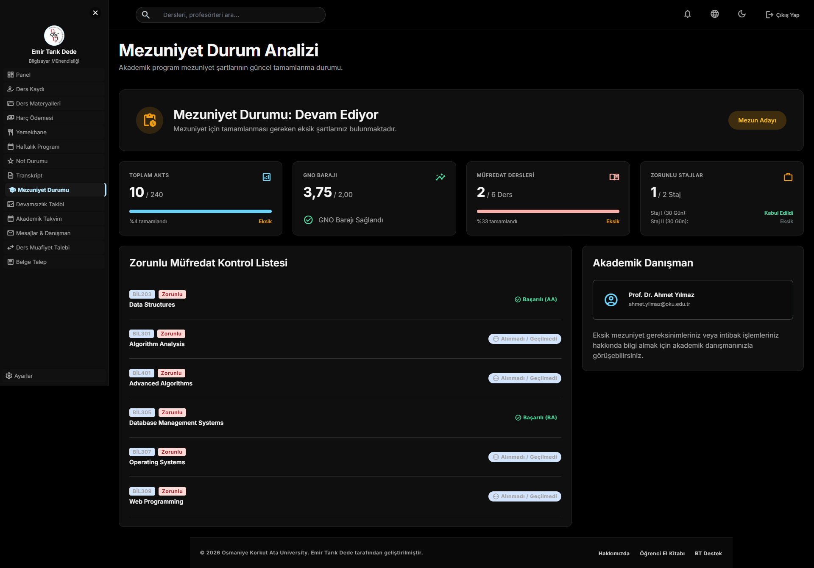

#### 13. Devamsızlık Durumu Takip Ekranı
Ders bazında devamsızlık yapılan hafta sayısının ve FZ (devamsızlıktan kalma) limit durumunun gösterildiği arayüz.
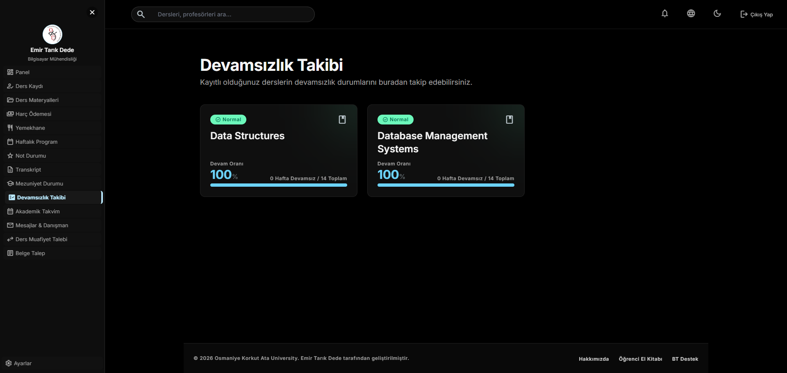

#### 14. Akademik Takvim
Üniversitenin eğitim-öğretim yılı boyunca uygulayacağı kayıt, sınav ve tatil tarihlerinin listelendiği takvim.
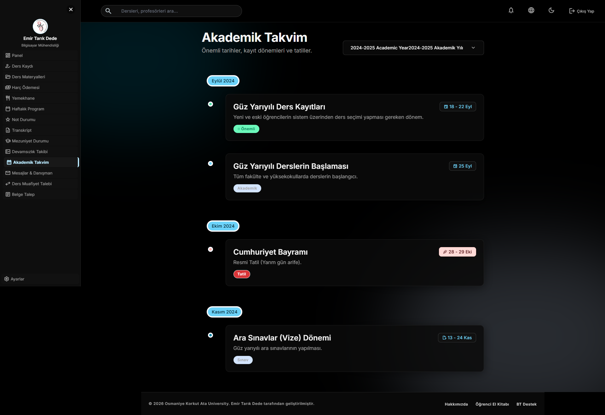

#### 15. Danışman Mesajlaşma Modülü
Öğrencinin kendi akademik danışmanı ile doğrudan güvenli mesaj gönderebildiği ve gelen mesajları okuyabildiği iletişim ekranı.
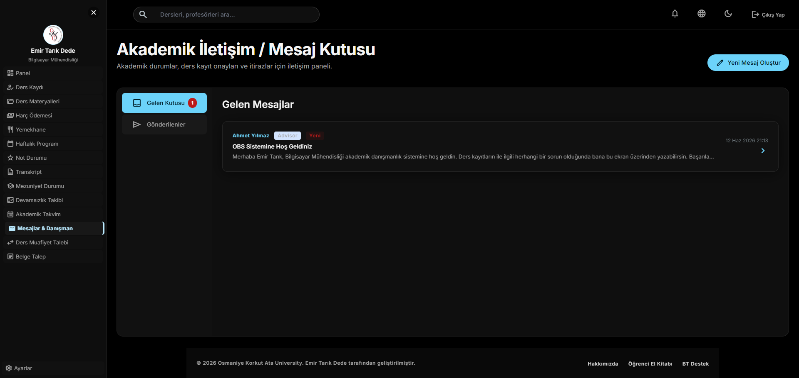

#### 16. Ders Muafiyet ve İntibak Talepleri
Öğrencilerin daha önce aldıkları veya muaf olmak istedikleri dersleri yeni müfredat dersleriyle eşleştirmek için başvuru yaptığı talep formu.
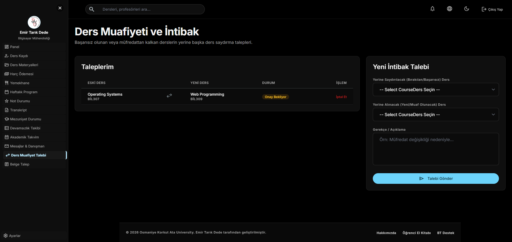

#### 17. Belge Talep Sistemi
Öğrenci belgesi, transkript gibi resmi belgelerin kopya sayısı ve kullanım amacı belirtilerek talep edildiği ekran.
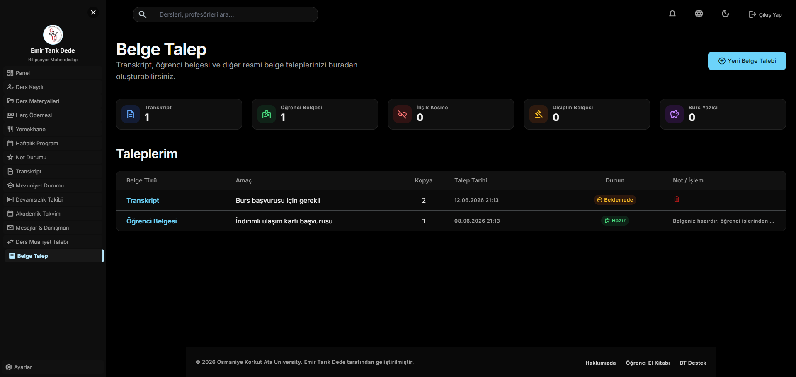

#### 18. Öğrenci Profil ve Tercih Ayarları
Dil seçimi (TR/EN), koyu/aydınlık tema değişimi, bildirim tercihleri, şifre güncelleme ve profil resmi düzenleme işlemleri.
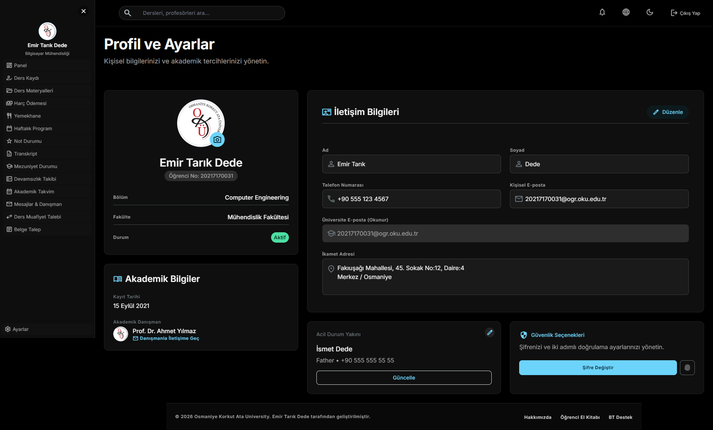

---

### 👨‍🏫 Danışman Akademisyen Ekranları

#### 19. Danışman Gösterge Paneli (Dashboard)
Danışmanın öğrencileriyle ilgili genel başarı istatistiklerini, not ortalamalarını, onur/uyarı listesinde bulunan öğrenci sayılarını gösteren gelişmiş istatistik ekranı.
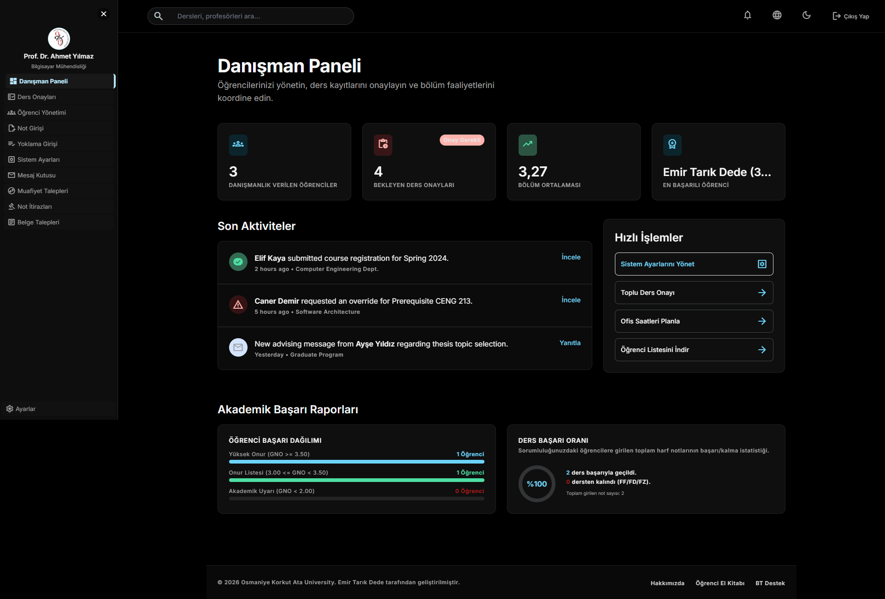

#### 20. Ders Onay Ekranı
Öğrencilerin gönderdiği ders kayıt taleplerinin AKTS sınırları doğrultusunda incelendiği, onaylandığı veya reddedildiği ders onay merkezi.
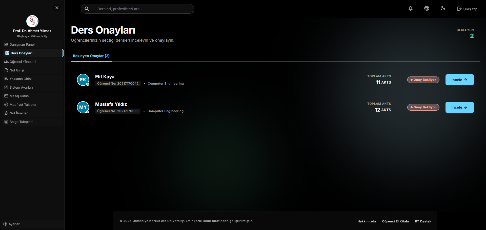

#### 21. Öğrenci Yönetimi Sayfası
Danışmanın kendisine kayıtlı olan öğrencileri listelediği ve yeni öğrenci kayıt işlemlerini gerçekleştirebildiği ekran.
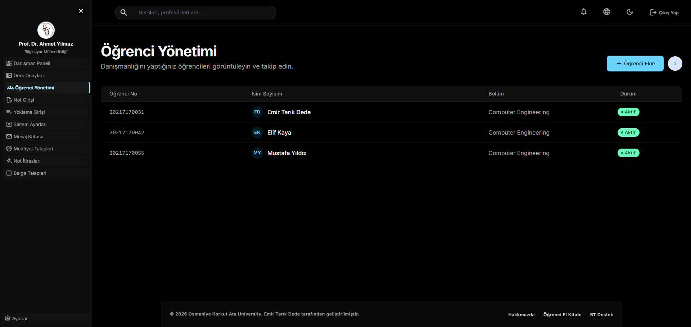

#### 22. Not Giriş Sistemi
Akademisyenlerin öğrencilerin vize ve final notlarını sisteme tekli olarak veya toplu ekleme formu ile girebildikleri ekran.
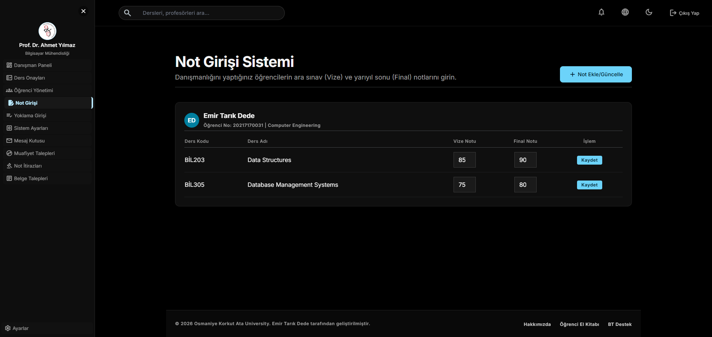

#### 23. Yoklama Giriş Sayfası
Ders bazında öğrencilerin devamsızlık durumlarının hafta olarak güncellendiği yoklama arayüzü.
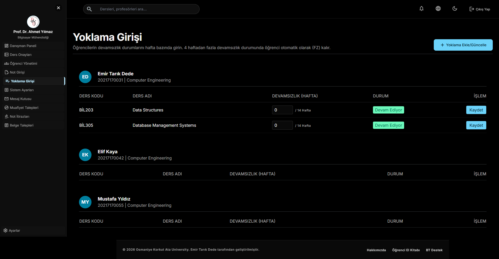

#### 24. Sistem ve Akademik Dönem Ayarları
Aktif dönemin seçilebildiği, ders kayıtlarının ve not girişlerinin sistemsel olarak açılıp kapatılabildiği yönetim paneli.
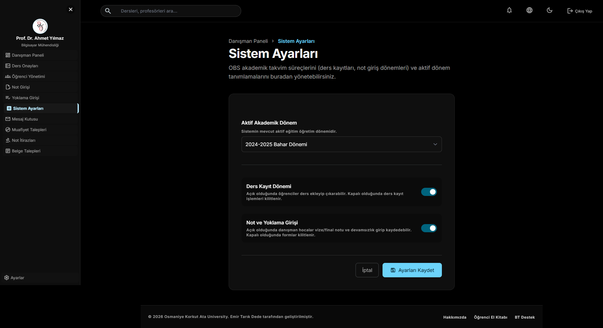

#### 25. Danışman Mesaj Kutusu
Danışmanın öğrencilerinden gelen mesajları yanıtlayabildiği ve onlara bilgilendirme mesajı gönderebildiği gelen kutusu.
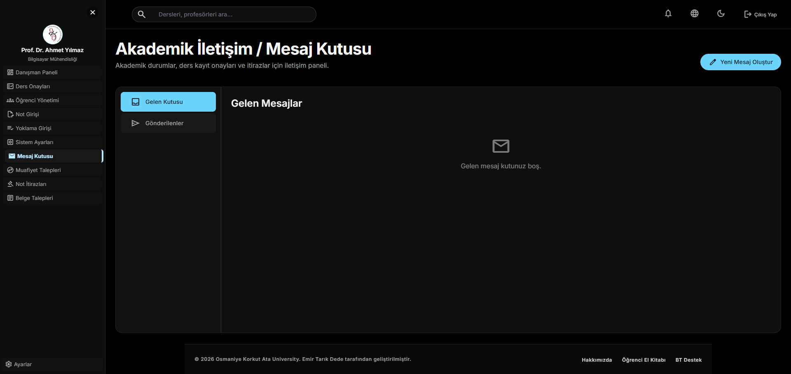

#### 26. Ders Muafiyet/İntibak Onayları
Öğrencilerin intibak ve muafiyet taleplerinin listelendiği, onaylanıp reddedilebildiği karar ekranı.
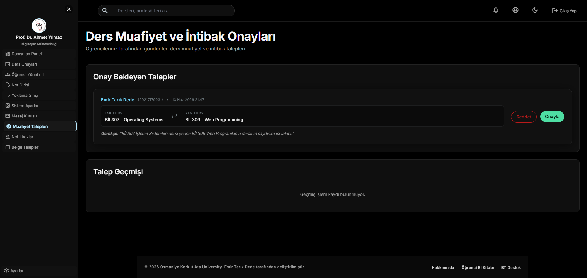

#### 27. Not İtiraz Yönetimi
Öğrencilerin sınav notlarına yaptıkları itirazların gerekçesiyle beraber incelenip yeni not girişleriyle karara bağlandığı yönetim ekranı.
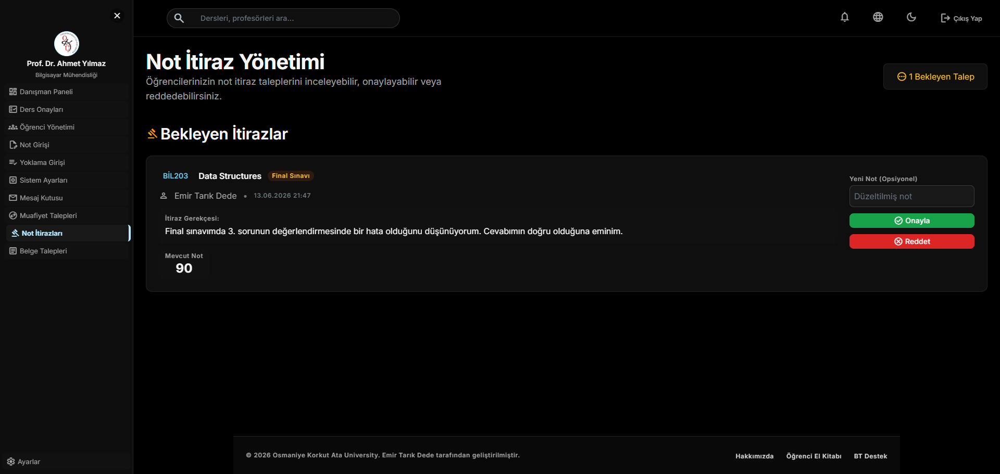

#### 28. Belge Talepleri Onay Modülü
Öğrenci belgesi ve transkript taleplerinin onaylanarak hazır hale getirildiği veya açıklama girilerek reddedildiği alan.
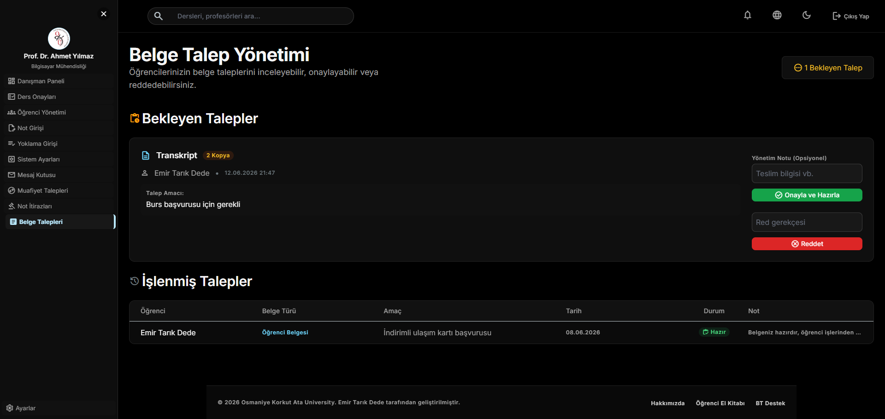

#### 29. Danışman Profil ve Ayarlar Sayfası
Danışman akademisyenin kendi bilgilerini güncelleyebildiği, dil ve tema tercihlerini ayarlayabildiği kişiselleştirilmiş ayar ekranı.
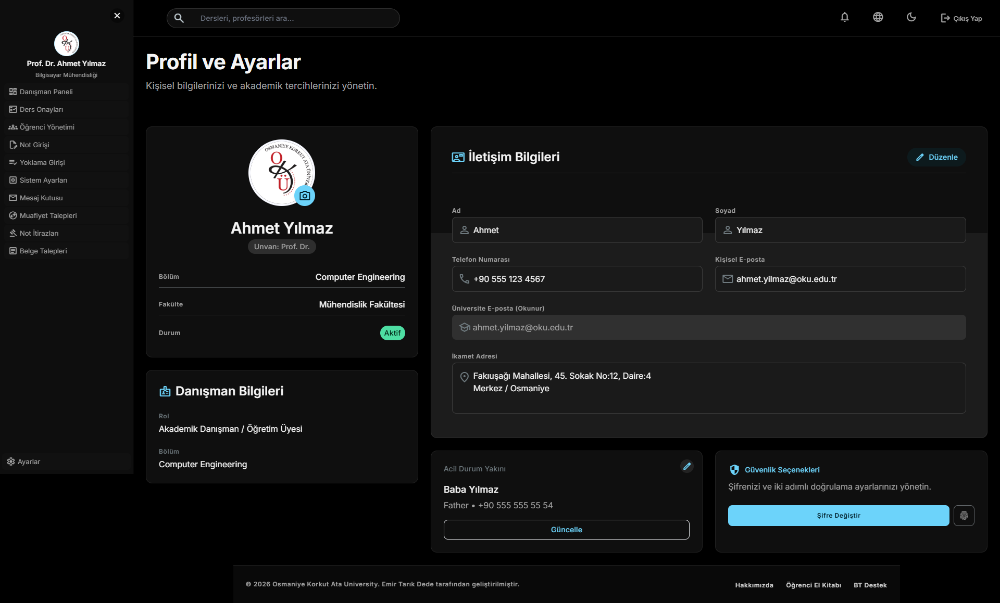

---

### 📄 Yardımcı ve Bilgi Ekranları

#### 30. Hakkımızda Sayfası
Üniversite ve OBS sistemiyle ilgili vizyon, misyon ve kurumsal bilgilerin sunulduğu sayfa.
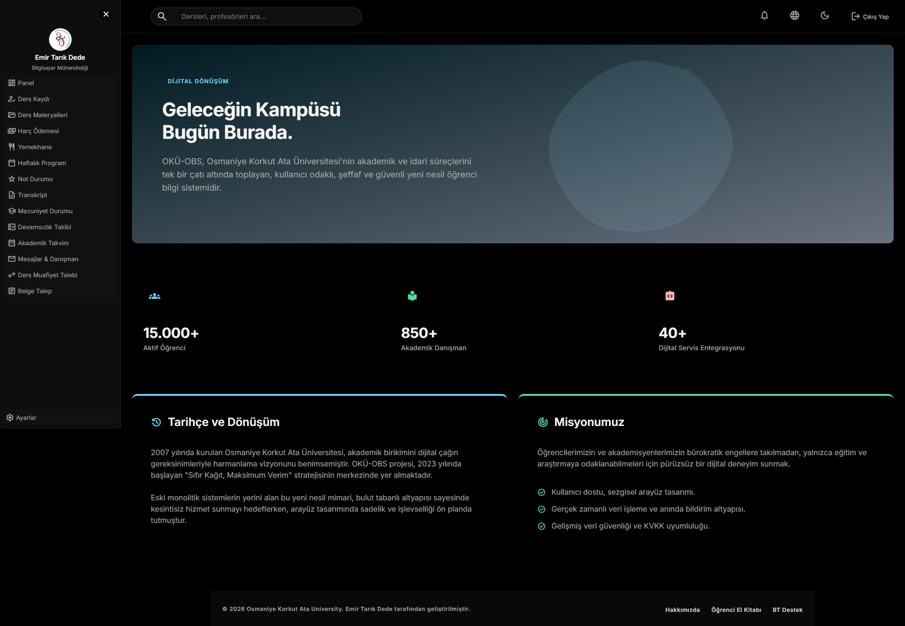

#### 31. Öğrenci El Kitabı
Yeni başlayan öğrencilere yönelik OBS kullanımı, akademik kurallar ve kampüs yaşamına dair rehber içeren döküman alanı.
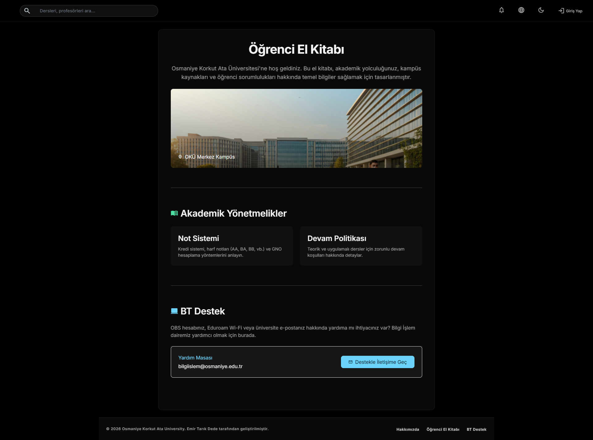

#### 32. BT Destek ve Yardım Talebi
Öğrencilerin ve akademisyenlerin yaşadıkları teknik sorunları bildirebildikleri kurumsal BT destek bilet arayüzü.
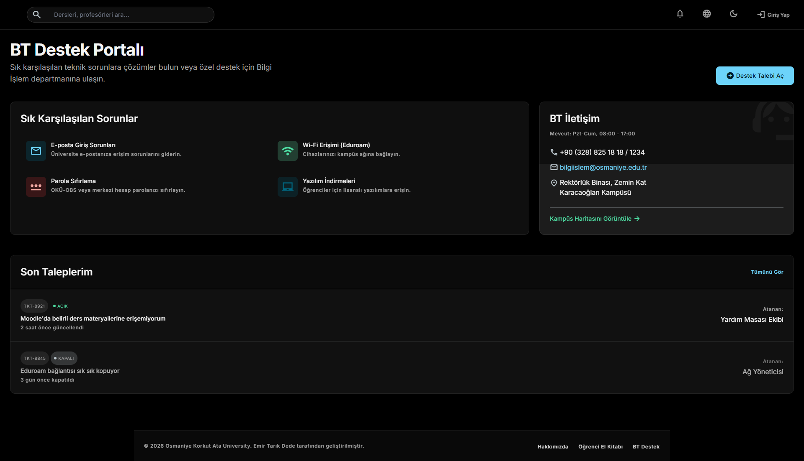

#### 33. Bize Ulaşın Arayüzü
Üniversite iletişim kanallarının, konum haritasının ve iletişim formunun yer aldığı sayfa.
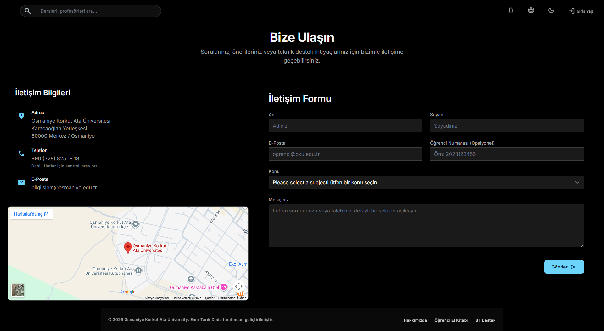

#### 34. Gizlilik Politikası ve Kullanım Koşulları
Kişisel verilerin korunması ve bilgi güvenliği politikalarını içeren bilgilendirme metinlerinin sunulduğu sayfa.
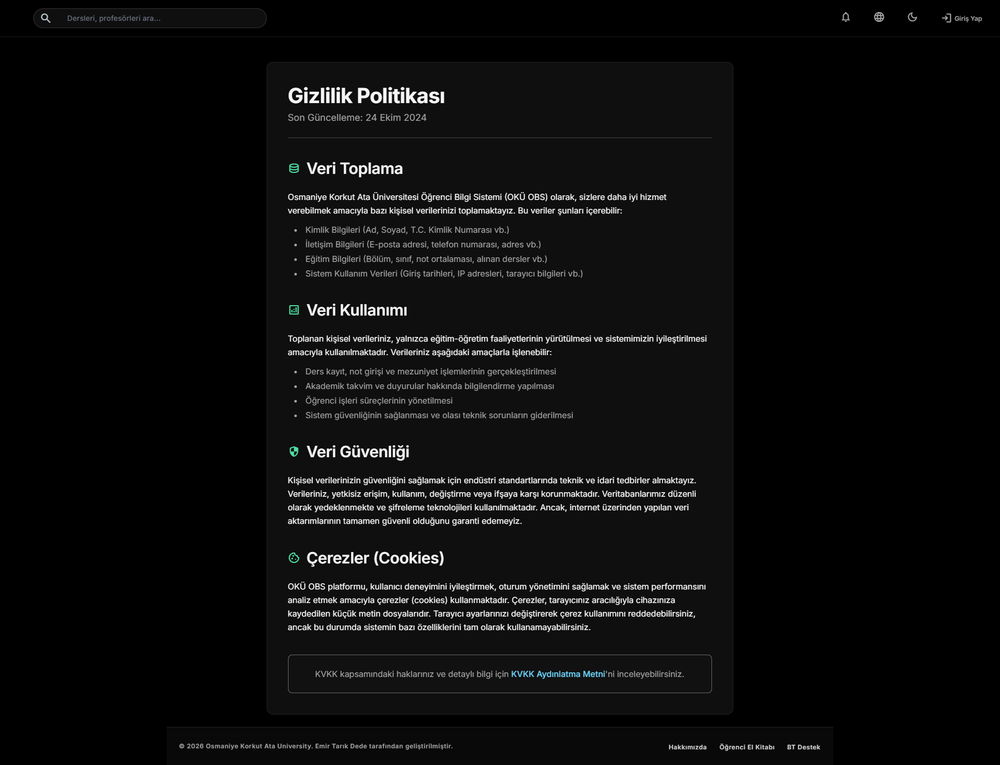

---

## 📜 Lisans (License)
Bu proje **MIT** lisansı altında lisanslanmıştır. Detaylar için `LICENSE` dosyasına göz atabilirsiniz.
